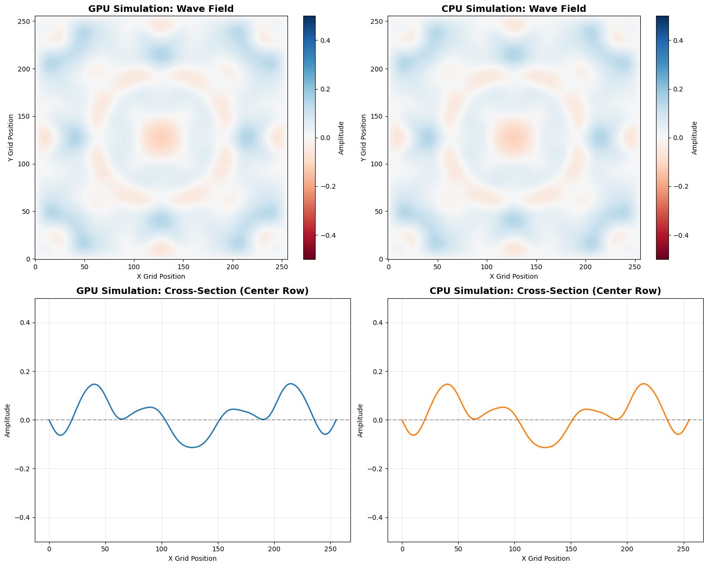
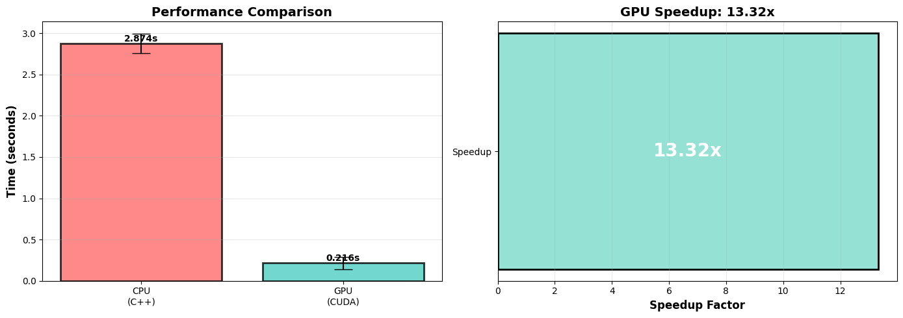

# CUDA-Accelerated Wave Equation Solver

A simple study  of CPU vs GPU implementations for solving the 2D wave equation using finite difference methods. This research explores C++ optimization and CUDA acceleration for scientific computing operators.

## 🎯 Research Goals

- Implement numerical PDE solvers in pure C++ and CUDA
- Benchmark performance differences between CPU and GPU implementations
- Find a framework for accelerating existing numerical methods
- Demonstrate practical CUDA programming for scientific computing


## 🧮 Mathematical Background

### 2D Wave Equation

```
∂²u/∂t² = c² ∇²u
```

**Discretization:**

- 5-point stencil for spatial Laplacian
- Explicit time-stepping scheme
- Zero Dirichlet boundary conditions

**Stability:** CFL condition `c·Δt/Δx < 1`

## 💻 Implementation Details

### CPU Version (C++)

- Sequential nested loops for spatial grid
- Manual boundary condition handling
- O(n²) complexity per timestep

### GPU Version (CUDA)

- 2D thread blocks (16×16)
- Parallel computation for all grid points
- Shared boundary condition logic
- Memory coalescing optimization

## 📊 Results Summary





## 🚀 Quick Start

One can simply use Google Colab to run. *Tested on: T4/L4 GPU*

## 📁 Project Structure

```
.
├── CPop.ipynb                    
├── wave_equation_cpu.cpp         
├── wave_equation_gpu.cu          
├── output_cpu.bin                
├── output_gpu.bin                
└── README.md                     
```

## 🔬 Notebook Cells Overview

| Cell | Purpose                                       |
| ---- | --------------------------------------------- |
| 1    | Check GPU availability & system info          |
| 2    | Write CPU implementation (C++)                |
| 3    | Write GPU implementation (CUDA)               |
| 4    | Compile both versions                         |
| 5    | Run CPU simulation                            |
| 6    | Run GPU simulation                            |
| 7    | Visualize results (heatmaps & cross-sections) |
| 8    | Performance benchmarking & comparison         |
| 9    | Verify numerical accuracy                     |

## 📚 Future Work

- [ ] 3D wave equation extension
- [ ] Multi-GPU support (Communication)
- [ ] Adaptive time-stepping
- [ ] Integration with ML frameworks (PyTorch custom ops)
- [ ] Comparison with cuFFT for spectral methods
- [ ] Shared memory optimization

## 📄 License

MIT License - see LICENSE file for details

## 🙏 Acknowledgments

- CUDA programming guide: [NVIDIA Developer Docs](https://docs.nvidia.com/cuda/)
